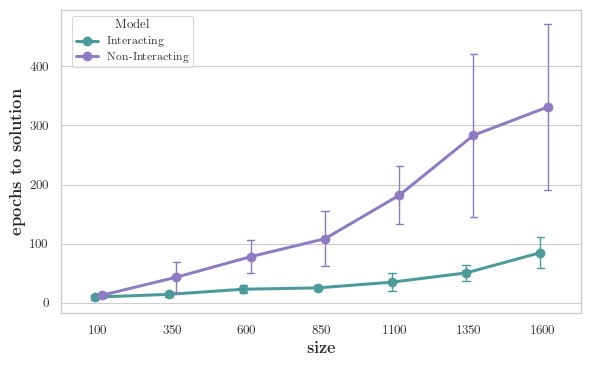
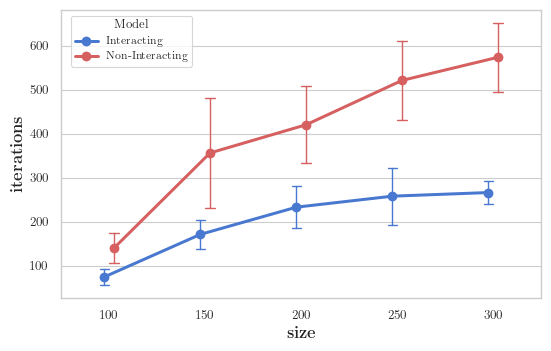

# Replicated Approach to the Binary Perceptron

This repository contains the code for my Bocconi University bachelor's thesis (see thesis_.pdf).

This project implements and compares standard vs. "replicated" versions of Simulated Annealing and Gradient Descent algorithms for solving the Binary Perceptron problem.

Inspired by statistical physics, the replicated approach is designed to find dense, robust clusters of solutions, bypassing isolated local minima.

## Results

As the plots show, the "Interacting" replicated models consistently converge to a solution significantly faster (in fewer epochs/iterations) than their standard "Non-Interacting" counterparts.

### Gradient Descent Comparison

### Simulated Annealing Comparison

